# ATNLP: Paper Implementation
## 📝 To do:
1. Implement attention in Encoder.py and Decoder.py **[Done]**
2. Implement evaluation of accuracy and save to wandb. **[Done]**
3. Setup more tests from the paper and train models:
    - 1a 'Simple train-test split': Axel
    - 1b 'Vary the size of the simple training split': Axel partially
    - 2 'Length train-test split': ?
    - 3 'Adding a new primitive' \[LTURN\]:
        - `overall-best`: 81.2% (90.0% paper).
        - `best` (GRU, 1 layer, 100 hidden, 0.1 dropout, with attn): 63.4% (90.3% paper).
    - 3 'Adding a new primitive' \[JUMP\]: 
        - `overall-best`: 0.7% (0.8% paper).
        - [0.0007786140669608098, 0.0003893070334804049, 0.0010381520892810796, 0, 0.0014274591227614846]
        - `best`: 0.1% (1.2% paper)
        - [0.0002595380223202699, 0, 0, 0, 0]
## 💫 Results Reproduced:
### Experiment 1: Generalizing to a random subset of commands
#### a
Repsonsible: Axel, Status: <span style="color:green">Done</span>
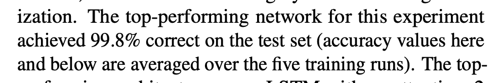
#### b
Repsonsible: Axel, Status: <span style="color:green">Done</span>
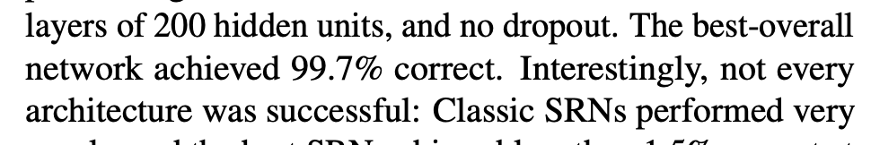
#### c
Repsonsible: Axel, Status: <span style="color:yellow">Training</span>
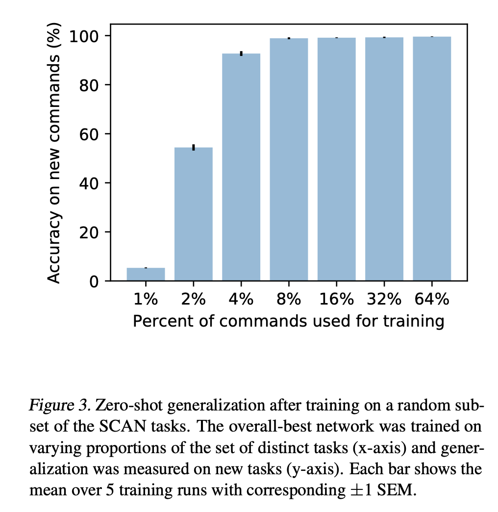
### Experiment 2: Generalizing to commands demanding longer action sequences
#### a
Repsonsible: Axel, Status: <span style="color:orange">Not trained</span>
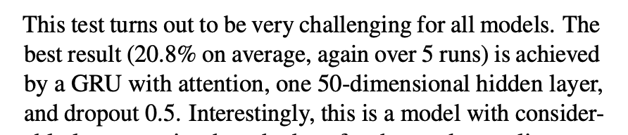
#### b
Repsonsible: Axel, Status: <span style="color:orange">Not trained</span>
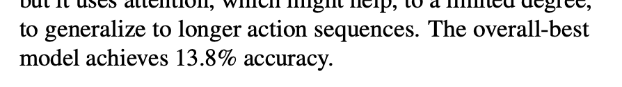
#### c
Repsonsible: Axel, Status: <span style="color:orange">Not trained</span>
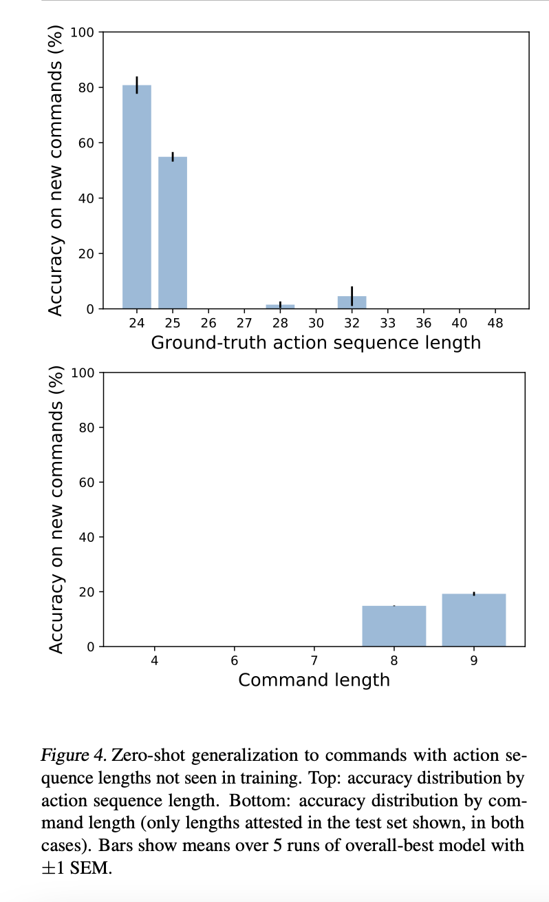

### Experiment 3: Generalizing composition across primitive commands
#### a
Repsonsible: Zi, Status: <span style="color:orange">Not trained</span>
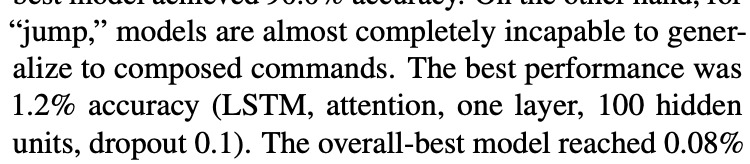
#### b
Repsonsible: Zi, Status: <span style="color:green">Done</span>
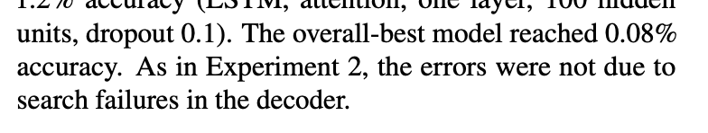
#### c
Repsonsible: Rasmus, Status: <span style="color:red">Done</span>
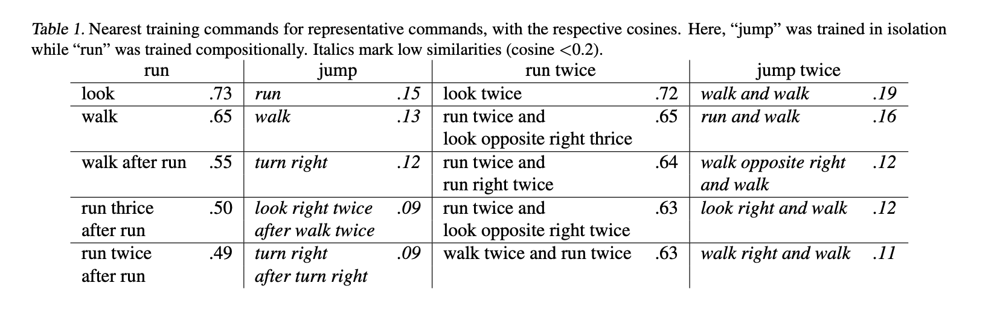
#### d
Repsonsible: Zi, Status: <span style="color:red">Not implemented</span>
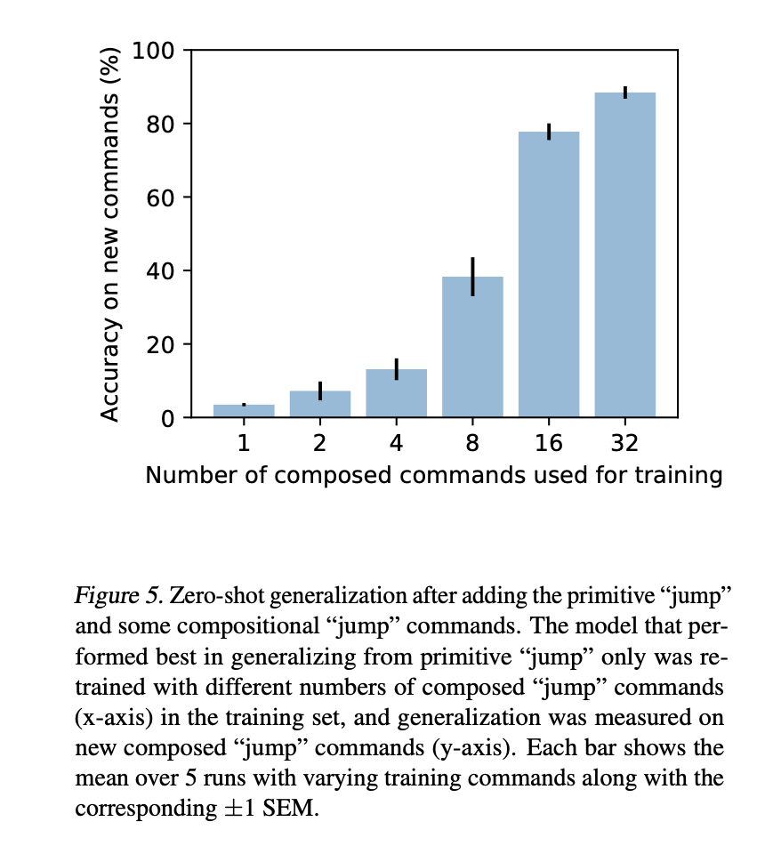

#### e
Repsonsible: Lukas, Status: ?
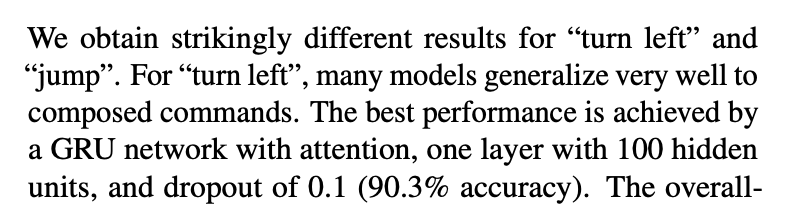

#### f
Repsonsible: Lukas, Status: ?
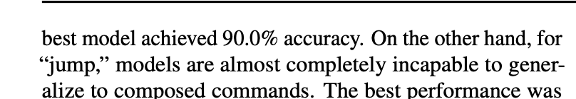

## 🏄‍♂️ Usage
### Local
For local use, simply run the `main.ipynb` notebook.

### Colab
When using colab, upload the `main.ipynb` notebook. Afterwards, add a cell to the top of the notebook with the following content:
```python
!git clone https://git_token@github.com/hojmax/Advanced-NLP-Paper-Implementation.git
%cd /content/Advanced-NLP-Paper-Implementation
```
The ```git_token``` should be replaced by your personal access token, and is required since the repo is private. You can generate a token by going to:

Settings -> Developer Settings -> Personal Access Tokens -> Tokens (classic)

When you push to the repository, you need to run ```!git pull``` and restart the runtime for the changes to take effect.

## Files
### Visualizations of teacher forcing gold actions to decoder for length-best experiment
[https://drive.proton.me/urls/T26WQHA05R#IkRs1XffONaM](https://drive.proton.me/urls/T26WQHA05R#IkRs1XffONaM)

## 🏋️ Weights & Biases

You can access [our W&B team here](https://wandb.ai/project-group-1). 

You will need an API key when connecting. This can be found in your settings.

## 📙 Resources
[Research Paper](https://arxiv.org/abs/1711.00350)

[SCAN Data](https://github.com/brendenlake/SCAN)

[Pytorch Seq2seq Documentation](http://pytorch.org/tutorials/intermediate/seq2seq_translation_tutorial.html)
